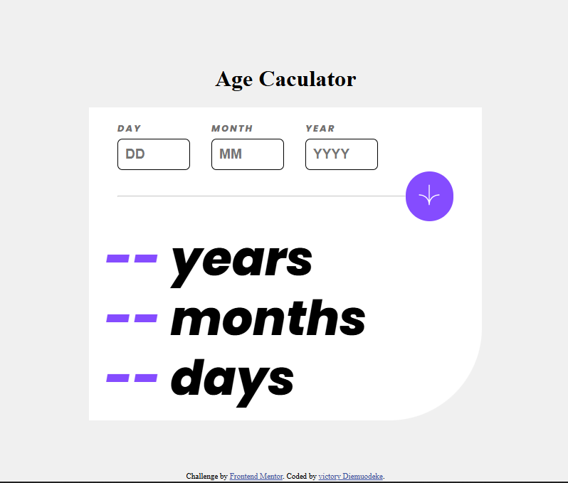

# Frontend Mentor - Age calculator app solution

This is a solution to the [Age calculator app challenge on Frontend Mentor](https://www.frontendmentor.io/challenges/age-calculator-app-dF9DFFpj-Q). Frontend Mentor challenges help you improve your coding skills by building realistic projects. 

## Table of contents

- [Overview](#overview)
  - [The challenge](#the-challenge)
  - [Screenshot](#screenshot)
  - [Links](#links)
- [My process](#my-process)
  - [Built with](#built-with)
  - [What I learned](#what-i-learned)
  
- [Author](#author)
- [Acknowledgments](#acknowledgments)

**Note: Delete this note and update the table of contents based on what sections you keep.**

## Overview

### The challenge

Users should be able to:

- View an age in years, months, and days after submitting a valid date through the form
- Receive validation errors if:
  - Any field is empty when the form is submitted
  - The day number is not between 1-31
  - The month number is not between 1-12
  - The year is in the future
  - The date is invalid e.g. 31/04/1991 (there are 30 days in April)
- View the optimal layout for the interface depending on their device's screen size
- See hover and focus states for all interactive elements on the page
 

### Screenshot




### Links

- Solution URL: [https://www.frontendmentor.io/solutions/age-calculator-app-i40Mmy0Ji8]
- Live Site URL: [https://victoryruro.github.io/age-calculator-app-main/]
## My process

### Built with

- Semantic HTML5 markup
- CSS custom properties
- Flexbox
- CSS Grid


### What I learned
  I have learnt a lot about DOM and date object  


To see how you can add code snippets, see below:


```js
day.addEventListener("input", () => {
    if(day.value !== ""){
        dayError.textContent = ""
        labels[0].style.color = "unset";
        inputFields[0].style.borderColor = "hsl(259, 100%, 65%)";

    }

});
```


## Author

- Website - [Victory Diemuodeke](https://diemuodeke-victory.netlify.app/)
- Frontend Mentor - [@Victoryruro](https://www.frontendmentor.io/profile/Victoryruro)
- X - [@Vicruro](https://x.com/Vicruro)

**Note: Delete this note and add/remove/edit lines above based on what links you'd like to share.**

## Acknowledgments

shoutout to God Almighty

**Note: Delete this note and edit this section's content as necessary. If you completed this challenge by yourself, feel free to delete this section entirely.**
